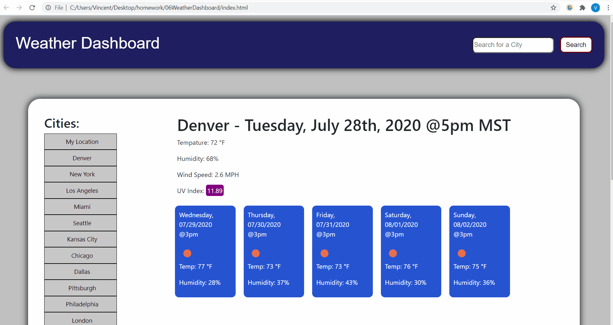

# 06WeatherDashboard

In this assignment, I have constructed a weather dashboard app that obtains weather data from the Open Weather Map API. Open Weather is a open source API that is free. Here is the link:

https://openweathermap.org/

This weather dashboard app does the following: obtains corrent weather data for a given location which includes tempature, humidity, wind speed, and the current UV Index. This app also gets a 5 day forcast of the given location for the same time the user is viewing this data, which includes the date & time, the waether icon provided by OpenWeatherMap, the tempature of that day, and the humidity. The user can get weather data for any city in the entire world using this app. The user has the option of selecting from over 400 different locations in the world. The user may also search for a location using the search bar. So if the user types in "Salt Lake City" then the search bar will autocomplete with suggestions and when the user clicks on the search button, the app pulls the current weather data for Salt Lake City, UT. 

The search city by ID is unavalable in this app as it is not very user friendly to search for a city by id because the user would have to look up the city by ID. The search bar also features an autocomplete feature using JQuery's Autocomplete function. I had to create my own array to accomplish this however, because you have to pay for the Google API and other APIs. This array does have over 400 search results avalable of locations you can lookup. This includes all 50 states in the US, all of the state capitols, most of the big cities accross the world, and most countries as well. So the autocomplete won't guess everything. But it does have a lot to chose from, thus making the app more user friendly. 

The user can also set their default location when the page loads, make their device location the default location, and reset all of the default settings to it's original state.

There are a few variables that are repeated in multiple functions that load the user's local storage. But this is intentional to prevent any bugs because the local storage is constanly being updated everytime a user adds or removes a location or changes a default setting. Otherwise if these variables were global then it would just load the same thing over and over again. So throughout the code you will see me repeat myself within the scope of a few different functions.

## loadSuggestions(LocationArray)

The loadSuggestions() functions takes in the location array that has over 400 locations and loads suggestions for the user as they are typing in the search bar. This makes the app more user firendly as they can now click on a suggestion and search it rather than havin to type out the entire location with accuracy. This function accomplishes this by using the JQUERY autocomplete function in it's library.

I did get the array from external sources so some of the searches in the autocomplete options may not work due to typos or OperWeatherAPI not supporting that location. But I would have to sit there and test all 400+ locations and that's just never happening. But the basic idea is to show how the autocomple function is used in JQUERY, it does not have to be perfect. I was going to use Google's location API to accomplish this instead. There are a bunch of ways to use that or a different API. But when I tried using Google's API it said that I had to provide payment information. Again, that's just not happening for this class project. So I decided to make my own location suggestion array from scratch instead.

## GetTodaysWeather(weatherURL)

The GetTodaysWeather(weatherURL) function takes in a weather via AJAX API from a URL from another function and gathers the data, then displays the data on the screen. This URL is generated and the function is fired off on the GetWeatherData(location) function.

If the user already has the location in their location list thin it will display a remove location button. If the user has not added the current location then it will display a add location button. 

The AJAX API method also has a potential error message that it will display if the user searches for an invalid value. So if the user searched for an invalid value, it will display a message, prompting them to try again.

## GetUVIndex(lat, lon)

Just like the GetTodaysWeather(weatherURL), the GetUVIndex(lat, lon) function gets data from an API using AJAX but this time it get's the current location's UV index using it's lattitude and longitute coordinates. This function is initiated in the GetTodaysWeather(weatherURL) when the API gives us the coordinate of the current location/city. Only with the location coordinates can we get the UV index and display it on the user's screen. Depending on the UV index value, the function will display it an a element with the cooresponding UV color. For example a low UV Index under 2 will display in green. A high UV index will display in purple.

## GetWeatherForecast(forecastURL)

Again just like the GetTodaysWeather(weatherURL) function, the GetWeatherForecast(forecastURL) gets weather data from a specific location using a provided API URL from AJAX and then displays that data on the user's screen, but this time it loads a 5 day forecast for that location. It uses a for loop to loop around every 24 hours and gets weathe data for the next 5 days.

## GetWeatherData(location)

The GetWeatherData(location) generates a weather API URL and then fires off the GetTodaysWeather(weatherURL) and the GetWeatherForecast(forecastURL) using the given API URL. This function generates these URLs based on the location that the user inputed, weather that be in the search bar or by clicking a location button.

## GetCordWeatherData()

The GetCordWeatherData() get's the user's location coordinates and then uses those coordinates to generate a open weather API link just like the  GetWeatherData(location) function but instead for specific location coordinates. Then it fires off the GetTodaysWeather(weatherURL) and the GetWeatherForecast(forecastURL) functions using the given URL. This function is activated when the user clicks the "My location" button or the "Make my device location the default location" button.

## LoadLocations()

The load locations function loads the left column of the page with location buttons and settings buttons. It also checks the local storage to see if this is a brand new user with no locations stored, or if the user just cleared their location list with one of the settings buttons, or if the user already has some location stored on their local machine, this function generates a list of buttons that can be used to access the weather data for those locations.

## $(document).on('click','.location',function()

The location button even listener listens for a location button click event, then it takes the value of that button (which will be a location) and then fires off the GetWeatherData(LocationValue) function which creates an API URL out of that location value. See the GetWeatherData(LocationValue) section of this readme to see what happens next.

## $(document).on('click','#SearchLocationbtn',function()

The search location button function event listener listens for the search button to be clicked. Once the search button is clicked, then it takes the value of the search location input field that the user entered, and it shoots off the GetWeatherData(LocationValue) function with the value that the user inputted in the search box. There is a comma added to the end of the search field just incase the user inputed a value that the API URL requires a comma at the end. For example, "Denver, CO" will not work with this API link. It has to be "Denver, CO," for the API link to work. This is only an issue with American cities and their corresponding state abbreviations. The comma is put there as a precaution to make sure all searches work.

## $(document).on('click','.MyLocation',function()

The my location event listener button initiates the GetCordWeatherData() function and get's the user coordinates and displays the user's coordinate weather. There is not much more to it. See the GetCordWeatherData() section of this readmen to see what happens next.

## $(document).on('click','#AddLocationbtn',function()

The add location button listener gets the current location that the user is displaying and adds it to the location array, then stores that array in the local storage. It also checks if the user has already stored this location in their array to avoid adding duplicates. I was going to add an error message here where if the user already has that location in their array, then it will display an error message saying they already added that location. But there is no need to display that message, instead this listener fires off the GetWeatherData(CurrentLocation) which then fires off the GetTodaysWeather(weatherURL) function which will refresh the page and check and see if the location is stored or not. If the location is already stored then it will display the remove location button instead of the add location button. So the user can just add or remove the location the see fit and the page automatically refreshes.

## $(document).on('click','#RemoveLocationbtn',function()

The remove location button listener removes the location when the user clicks on the remove location button. First it checks the array stored on the local machine, then it checks if the current location the user is on is on the array. Just in case. Just like that add location button click listener, I was going to add an error message saying that the location was already removed or does not exist but this listener does not need a error message because it will not display this button on a location that is not locally stored on the array. Again, this is accomplished by making the listener fire off the GetWeatherData(CurrentLocation) function which then fires off the GetTodaysWeather(weatherURL) function which refreshes the page and replaces the remove location button with the add location button.

This makes the app more user friendly as they are not presented with a bunch of buttons that don't work and create error message and they are only presented with buttons that do work and actually do something based on what they have locally stored. The error message is then only needed when the user enters an invalid search.

## $(document).on('click','#SetDefaultButton',function()

The set default button event listener listens for the set default button click. When the user clicks on this button, then it checks the local storage for the defualt location that the user will load when they first fisit the website. If the user already has the location set as the default, then it will say they alread have set it as the default. If the user is setting a new location as the default, then it stores that location as the default.

## $(document).on('click','#CoordDefaultButton',function()

Just like the set defualt button listener, the Coordinate default button listener will set the user's coordinates as the location. Doing this will make the page load the users coordinates when they refresh the browser or open then close the browser. That way, no matter where the user is, it will load their location coordinates instead of a defualt location. Again to make the app more user firendly in case they only care about their own location weather because most people only care about the local weather. So if you activate this setting, then refresh the page in Denver it will automatically load weather for the user's coordinates in Denver.

## $(document).on('click','#ResetDefaultButton',function()

This button event click listener first alerts the user to make them confirm weather or not they want to erase their data to prevent erasing it by mistake. In my opinion, this is the most important place to put an alert message to prevent the user from erasing all of their stuff by mistake. If the user confirms the want to erase all their settings and restores it to their defaults, then it removes the locally stored Locations and DefaultLocation items, and then refreshes the page with the default Denver weather, reloads the locations, and displays a message saying everything was stored to default. If the user rejects the confirmation then nothing happens.

## LoadDefaults()

The load storage function always loads by default when the user visits the page. So if the user is brand new, this function fires off. If this is a repeat user, this function fires off with their settings that they may or may not have modified. First this function checks the local storage for the default location that the user has set. If the value is null then it is a new user or it is a repeat user that has not set a default location value and it will set Denver, CO as the default location that displays weather info for. Thu user may change this default location if they see fit because not everyone lives in or cares about Denver's weather. This is done with the SetDefaultButton event listener.

